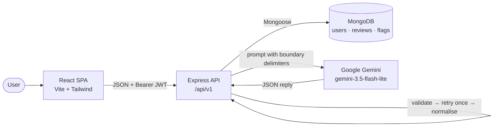

# DevLens

[](https://github.com/harshhhhss/DevLens/actions/workflows/ci.yml)
[](LICENSE)

**AI-powered code review, structured.** Paste a snippet or drop a source file, pick a language,
and get back bugs, security vulnerabilities, performance issues, refactor suggestions,
maintainability scores and a rewritten clean version — in seconds, powered by Google Gemini.
Every AI response is validated before it reaches you, and submitted code is passed to the model
as data rather than as instructions.

---

## Table of Contents

- [Features](#features)
- [Tech Stack](#tech-stack)
- [Architecture at a Glance](#architecture-at-a-glance)
- [Project Structure](#project-structure)
- [Setup](#setup)
- [Environment Variables](#environment-variables)
- [API Reference](#api-reference)
- [Data Models](#data-models)
- [Security](#security)
- [Testing](#testing)
- [Deployment](#deployment)
- [Known Limitations](#known-limitations)
- [License](#license)

---

## Features

**Review output** — every review returns:

- **Bugs** — logic errors and edge cases, with the line and a suggested fix
- **Security vulnerabilities** — each rated Low / Medium / High / Critical
- **Performance issues** — inefficiencies and their optimisations
- **Refactor suggestions** — maintainability and readability improvements
- **Maintainability scores** — readability, security and overall, each out of 10
- **A rewritten clean version** of the submitted code

**Working with it**

- **Paste or upload** — type code directly, or drag-and-drop / pick a source file. The language
  is detected from the file extension and the dropdown follows it automatically
- **Review history** — every review is saved per user and can be reopened from the History page
- **Nine languages** — JavaScript, TypeScript, Python, Java, C++, Go, Rust, PHP, Ruby

**Reliability and safety**

- **Validated AI output** — Gemini's reply is checked for shape before it is trusted. A malformed
  reply is retried once; if the retry also fails the request returns `502` and nothing is saved
- **Prompt-injection resistant** — submitted code is wrapped in a delimiter carrying a random
  per-request token and explicitly marked as untrusted data, so instruction-like text inside it
  cannot address the model
- **Attempt monitoring** — suspicious instruction-like phrases in comments are flagged and
  recorded without blocking the review

> Uploads are **one file per review**. There is no batch/multi-file mode.

---

## Tech Stack

| Layer | What's used |
| ----- | ----------- |
| **Frontend** | React 18.3, Vite 5.4, Tailwind CSS 3.4, React Router 6.26, axios 1.7, react-syntax-highlighter 15.5 |
| **Backend** | Node.js 18+, Express 4.19, Mongoose 8.5 |
| **Database** | MongoDB (Atlas or local) |
| **AI** | Google Gemini via `@google/generative-ai` 0.21 — model `gemini-3.5-flash-lite` |
| **Auth** | `jsonwebtoken` 9.0, `bcryptjs` 2.4 |
| **Security** | `helmet` 8.3, `express-rate-limit` 8.7, `express-validator` 7.3 |
| **Testing** | Vitest, Supertest 7.2, mongodb-memory-server 11.2, React Testing Library 16.3, jsdom |
| **CI** | GitHub Actions |

---

## Architecture at a Glance



The API never returns an AI response straight through: it is parsed, shape-validated, retried once
on failure, then normalised before being saved and sent back.

**→ See [ARCHITECTURE.md](ARCHITECTURE.md)** for the full request flow, layer responsibilities,
entity relationships, auth flow, the layered security model, and the engineering decisions behind
them.

---

## Project Structure

```
DevLens/
├── .github/workflows/ci.yml       CI: server tests, client tests + build
├── client/                        React frontend (Vite)
│   ├── public/                    favicon.svg, og-image.png
│   ├── src/
│   │   ├── components/            Alert, CleanCodeViewer, CodeInput, ErrorBoundary,
│   │   │                          IssueList, LanguageSelect, Navbar, ProtectedRoute,
│   │   │                          ReviewResult, ScoreCard, SeverityBadge, Spinner
│   │   ├── pages/                 Home (review), Login, Register, History
│   │   ├── services/              api.js — axios instance + endpoint wrappers
│   │   ├── context/               AuthContext.jsx — session state
│   │   ├── utils/                 errorMessage.js, fileToCode.js
│   │   ├── tests/                 setup.js
│   │   ├── App.jsx  main.jsx  index.css
│   ├── index.html                 meta tags, Open Graph, fonts
│   ├── vite.config.js             dev server + Vitest config
│   └── tailwind.config.js
├── server/                        Express API
│   ├── config/                    db.js (Mongo connection), validateEnv.js (startup check)
│   ├── controllers/               authController.js, reviewController.js
│   ├── middleware/                authMiddleware, errorMiddleware, rateLimiters, validators
│   ├── models/                    User, Review, PromptFlag, ReviewValidationFailure
│   ├── routes/                    authRoutes.js, reviewRoutes.js
│   ├── services/                  aiService.js, promptSafety.js, reviewValidation.js
│   ├── tests/                     auth, review, config, aiSafety + setup.js
│   ├── app.js                     builds the Express app (no DB, no listen)
│   ├── server.js                  startup: env check → DB → listen
│   └── vitest.config.mjs
├── LICENSE
├── ARCHITECTURE.md
└── README.md
```

`app.js` is deliberately separate from `server.js` so tests can mount the API with Supertest
without connecting to a database or binding a port.

---

## Setup

### Prerequisites

- **Node.js 18+** (CI runs on Node 20)
- **MongoDB** — local instance or a MongoDB Atlas cluster
- **A Google Gemini API key** — from [Google AI Studio](https://aistudio.google.com/app/apikey)

### 1. Backend

```bash
cd server
npm install
cp .env.example .env
```

Fill in `server/.env` (see [Environment Variables](#environment-variables)). All five variables
are required — the server validates them at startup and exits naming any that are missing.

```bash
npm run dev        # nodemon, http://localhost:5055
# or
npm start          # plain node
```

Port **5055** is a deliberate non-default, chosen so it does not collide with other services
commonly running on `5000`.

### 2. Frontend

```bash
cd client
npm install
cp .env.example .env
npm run dev        # http://localhost:5173
```

> `VITE_*` variables are inlined at **build** time, not read at runtime. Restart the dev server
> (or redeploy) after changing `client/.env`.

### 3. Tests

```bash
cd server && npm test      # 93 tests
cd client && npm test      # 85 tests
```

---

## Environment Variables

### `server/.env`

| Variable | Description | Required | Example |
| -------- | ----------- | -------- | ------- |
| `PORT` | Port the API listens on | Yes | `5055` |
| `MONGO_URI` | MongoDB connection string | Yes | `mongodb://127.0.0.1:27017/devlens` |
| `JWT_SECRET` | Secret used to sign auth tokens — use a long random string | Yes | `replace_with_a_long_random_secret` |
| `GEMINI_API_KEY` | Google Gemini API key | Yes | `your_gemini_api_key_here` |
| `CLIENT_URL` | Allowed CORS origin(s). Comma-separate for multiple | Yes | `http://localhost:5173` |

All five are enforced by `server/config/validateEnv.js` at startup. A missing or blank value
stops the process with a message naming the variable and what it is for.

### `client/.env`

| Variable | Description | Required | Example |
| -------- | ----------- | -------- | ------- |
| `VITE_API_BASE_URL` | Base URL of the API, including `/api/v1` | Yes in production | `http://localhost:5055/api/v1` |

`VITE_API_URL` is still accepted as a fallback name for older local setups. In a **production**
build, if neither is set the app throws on startup rather than silently falling back to
`localhost` — a deployed bundle pointing at the visitor's own machine is never correct. In
development it falls back to `http://localhost:5055/api/v1`.

---

## API Reference

Base path: **`/api/v1`**. All request and response bodies are JSON. Authenticated routes expect
an `Authorization: Bearer <token>` header. Every error response has the shape `{ "message": "..." }`.

### Health

| Method | Path | Auth |
| ------ | ---- | ---- |
| `GET` | `/health` | No |

`200` → `{ "status": "ok", "service": "devlens-api" }`

### Auth

#### `POST /auth/register`

Auth: **No**. Body: `{ "name", "email", "password" }` (password min 6 characters).

`201` → `{ "_id", "name", "email", "token" }`

| Status | Trigger |
| ------ | ------- |
| `400` | Missing name/email/password, invalid email format, or password under 6 characters |
| `409` | An account with that email already exists |
| `429` | More than 10 failed auth attempts from one IP in 15 minutes |
| `500` | Unexpected server error |

#### `POST /auth/login`

Auth: **No**. Body: `{ "email", "password" }`.

`200` → `{ "_id", "name", "email", "token" }`

| Status | Trigger |
| ------ | ------- |
| `400` | Email or password missing |
| `401` | Wrong password **or** unknown email — deliberately identical, so registered addresses are not enumerable |
| `429` | Rate limit (as above) |
| `500` | Unexpected server error |

#### `GET /auth/me`

Auth: **Yes**. `200` → `{ "_id", "name", "email" }`

| Status | Trigger |
| ------ | ------- |
| `401` | No token, malformed/expired token, or the token's user no longer exists |

### Reviews

All review routes require authentication (`router.use(protect)`).

#### `POST /review`

Body: `{ "code": "...", "language": "javascript" }` — language must be one of the nine supported
values; code must be non-empty and at most 20,000 characters.

`201` → the saved Review document:

```json
{
  "_id": "...",
  "userId": "...",
  "code": "function add(a, b) { return a + b }",
  "language": "javascript",
  "result": {
    "summary": "...",
    "bugs": [{ "line": 1, "issue": "...", "fix": "..." }],
    "security": [{ "line": 2, "severity": "Critical", "issue": "...", "fix": "..." }],
    "performance": [{ "line": 5, "issue": "...", "fix": "..." }],
    "refactor": [{ "suggestion": "...", "reason": "..." }],
    "scores": { "readability": 7, "security": 3, "overall": 5 },
    "cleanCode": "..."
  },
  "createdAt": "...",
  "updatedAt": "..."
}
```

| Status | Trigger |
| ------ | ------- |
| `400` | Code missing/blank, code over 20,000 characters, or an unsupported language |
| `401` | Missing or invalid token |
| `429` | More than 30 review submissions from one IP in an hour |
| `502` | Gemini's reply failed shape validation on both the first attempt and the retry — nothing is saved |
| `500` | Gemini request failed outright, or an unexpected server error |

#### `GET /review/history`

Query: `page` (default 1), `limit` (default 10, max 50).

`200` → `{ "reviews": [...], "page", "totalPages", "total" }` — newest first, with the `code`
field omitted from the list for payload size.

| Status | Trigger |
| ------ | ------- |
| `401` | Missing or invalid token |

#### `GET /review/:id`

`200` → the full Review document including `code`.

| Status | Trigger |
| ------ | ------- |
| `401` | Missing or invalid token |
| `404` | No such review, **or** it belongs to another user, **or** the id is not a valid ObjectId |

#### `DELETE /review/:id`

`200` → `{ "message": "Review deleted" }`

| Status | Trigger |
| ------ | ------- |
| `401` | Missing or invalid token |
| `404` | Same conditions as `GET /review/:id` |

### Unmatched routes

Any path that matches no route returns `404` → `{ "message": "Route not found - <path>" }`.

---

## Data Models

All models register idempotently (`mongoose.models.X || mongoose.model(...)`) so re-evaluating a
module under a test runner or hot reload cannot throw `OverwriteModelError`.

### `User` — an account

| Field | Type | Notes |
| ----- | ---- | ----- |
| `name` | String | Required, trimmed |
| `email` | String | Required, unique, lowercased, trimmed, format-checked |
| `password` | String | Required, min 6 chars, `select: false` — bcrypt-hashed on save (salt rounds 10) |
| `createdAt` / `updatedAt` | Date | Timestamps |

Instance method `matchPassword(plain)` compares against the hash.

### `Review` — one completed code review

| Field | Type | Notes |
| ----- | ---- | ----- |
| `userId` | ObjectId → `User` | Required, indexed |
| `code` | String | Required — the submitted source |
| `language` | String | Required, enum of the nine supported languages |
| `result` | Subdocument | `summary`, `bugs[]`, `security[]`, `performance[]`, `refactor[]`, `scores{readability,security,overall}`, `cleanCode` |
| `createdAt` / `updatedAt` | Date | Timestamps |

Findings carry `line` / `issue` / `fix`; `security` entries additionally carry `severity`
(`Low` \| `Medium` \| `High` \| `Critical`); `refactor` entries carry `suggestion` / `reason`.

### `PromptFlag` — a suspected prompt-injection attempt

| Field | Type | Notes |
| ----- | ---- | ----- |
| `userId` | ObjectId → `User` | Indexed, nullable |
| `language` | String | Submitted language |
| `patterns` | [String] | Which suspicious phrases matched, e.g. `ignore-previous` |
| `codeHash` | String | SHA-256 of the submission, indexed — groups repeat attempts without storing code twice |
| `snippet` | String | First 300 characters, for eyeballing |
| `codeLength` | Number | Length of the full submission |
| `createdAt` / `updatedAt` | Date | Timestamps |

### `ReviewValidationFailure` — an unusable AI response

| Field | Type | Notes |
| ----- | ---- | ----- |
| `userId` | ObjectId → `User` | Indexed, nullable |
| `language` | String | Submitted language |
| `failures` | [String] | Which checks failed, e.g. `scores.readability: expected a number` |
| `attempts` | Number | Gemini calls made before giving up (2 = the retry also failed) |
| `rawSnippet` | String | First 500 characters of Gemini's reply, for debugging |
| `createdAt` / `updatedAt` | Date | Timestamps |

---

## Security

| Layer | What it does |
| ----- | ------------ |
| **Helmet** | Standard security headers (`X-Content-Type-Options`, `X-Frame-Options`, …) and removes the `X-Powered-By` fingerprint |
| **CORS allow-list** | Only origins in `CLIENT_URL` may call the API; comma-separated for preview deploys. Origin-less requests (health checks, curl) pass |
| **Rate limiting** | `/auth/login` + `/auth/register`: 10 per 15 min per IP, counting **failed** attempts only. `POST /review`: 30/hour, protecting the Gemini quota as much as the server |
| **Input validation** | `express-validator` rules on every auth and review route, running *before* controllers. The frontend's checks are a convenience, not the boundary |
| **Password handling** | bcrypt hashing with salt rounds 10; `select: false` so hashes are never returned |
| **JWT auth** | 30-day signed tokens; `protect` middleware verifies the signature and re-loads the user on every request, so a deleted user's token stops working immediately |
| **Ownership scoping** | Reviews are queried by `{ _id, userId }`, so another user's review returns `404` rather than `403` — existence is not leaked |
| **Prompt-injection defence** | Code is wrapped in `<user_code boundary="…">` with a random 16-hex token per request and labelled untrusted data. Attempts are flagged to `PromptFlag`, not blocked |
| **AI output validation** | Gemini's reply is shape-checked before it is trusted; failures retry once, then `502`, logged to `ReviewValidationFailure` |

Email normalisation is deliberately **not** applied — `normalizeEmail()` strips dots and plus-tags
from Gmail addresses, which would silently change the identity a user registered under.

See [ARCHITECTURE.md](ARCHITECTURE.md#security-architecture) for what each layer defends against.

---

## Testing

**178 tests** — 93 backend, 85 frontend.

```bash
cd server && npm test          # vitest run
cd server && npm run test:watch

cd client && npm test
cd client && npm run test:watch
```

### Backend — 93 tests across 4 files

| File | Covers |
| ---- | ------ |
| `tests/auth.test.js` | Register/login/me: JWT issuance and verification, bcrypt hashing, duplicate emails, case-insensitive login, identical responses for unknown user vs wrong password, forged and orphaned tokens |
| `tests/review.test.js` | The review endpoint: persistence and ownership, language normalisation, history pagination and scoping, markdown-fenced replies, score rounding, failure paths |
| `tests/aiSafety.test.js` | Output validation (every field and boundary), the injection scanner, boundary-token generation, retry-then-`502` behaviour, and `PromptFlag` / `ReviewValidationFailure` records |
| `tests/config.test.js` | Startup env validation and the Helmet/404 middleware |

Backend tests run against an **in-memory MongoDB** (`mongodb-memory-server`) and stub global
`fetch`, so they exercise the real models, the real `aiService` — prompt construction, JSON
extraction, validation, retry and normalisation — without touching a database or spending a
Gemini call.

### Frontend — 85 tests across 5 files

| File | Covers |
| ---- | ------ |
| `utils/fileToCode.test.js` (38) | Extension→language mapping, size/binary/empty rejection, the 20,000-character limit |
| `services/api.test.js` (15) | Base-URL resolution, the JWT request interceptor, 401 handling, endpoint wrappers |
| `utils/errorMessage.test.js` (14) | Mapping network/timeout/status failures to actionable messages |
| `components/ScoreCard.test.jsx` (10) | Score colour thresholds (red < 5, yellow 5–7, green > 7) |
| `components/CodeInput.test.jsx` (8) | File picker and drag-and-drop, error reporting, clearing, and that typing still works |

### CI

`.github/workflows/ci.yml` runs on every push and pull request to `main`, as two parallel jobs on
`ubuntu-latest` / Node 20:

- **Server tests** — `npm ci`, `npm test`
- **Client tests** — `npm ci`, `npm test`, then `npm run build` (a build failure is a real
  regression even when every test passes)

---

## Deployment

DevLens is designed to deploy as three independent pieces.

| Piece | Host | Notes |
| ----- | ---- | ----- |
| Frontend | **Vercel** | Root directory `client`, build `npm run build`, output `dist` |
| Backend | **Render** | Root directory `server`, build `npm install`, start `npm start` |
| Database | **MongoDB Atlas** | Allow your backend host's egress IPs in Network Access |

**Frontend (Vercel)** — set `VITE_API_BASE_URL` to your deployed API base, including `/api/v1`
(e.g. `https://your-api.onrender.com/api/v1`). It is read at **build** time, so a change needs a
fresh deploy, not a restart.

**Backend (Render)** — set all five server variables. `CLIENT_URL` must be your deployed frontend
origin, or CORS will reject the browser's requests; it accepts a comma-separated list, which is
how you allow Vercel preview URLs alongside production.

**Cold starts** — Render's free tier spins down when idle, so the first request after a quiet
period can take ~50s. The client surfaces this as a timeout message rather than a generic error.

---

## Known Limitations

- **`npm audit`: 5 moderate advisories in client production dependencies.** `prismjs` (via
  `refractor` ← `react-syntax-highlighter`) and two `react-router` advisories. Both fixes require
  breaking major upgrades (`react-syntax-highlighter@16`, `react-router-dom@7`), so they are
  tracked rather than auto-applied.
- **`npm audit`: 3 moderate advisories in server production dependencies** — `qs`, pulled in by
  Express 4. A non-breaking `npm audit fix` is available.
- **One file per review.** Uploads are single-file; there is no batch or whole-repository mode.
- **20,000-character limit** per submission, enforced on both client and server.
- **No refresh tokens.** JWTs last 30 days and there is no revocation list; logging out clears the
  token client-side only.
- **Rate limiting is in-memory per process.** Counters reset on restart and are not shared across
  instances, so horizontal scaling would need a shared store.
- **The injection scanner is heuristic.** It is monitoring, not enforcement — containment comes
  from the prompt delimiters, and the scanner will both miss novel phrasings and occasionally
  flag innocuous comments.
- **No pagination UI beyond next/previous**, and no search or filtering over review history.

---

## License

[MIT](LICENSE)
